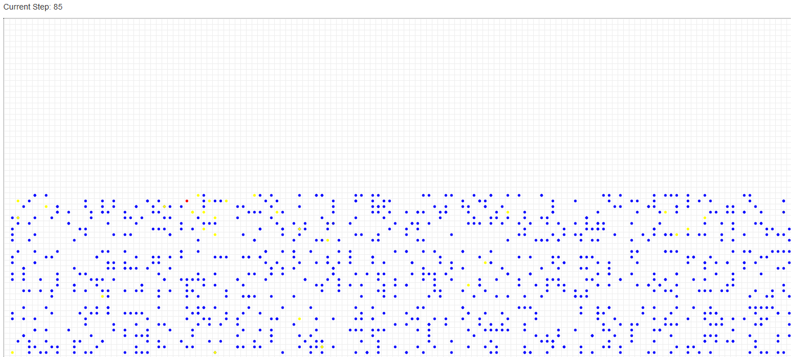
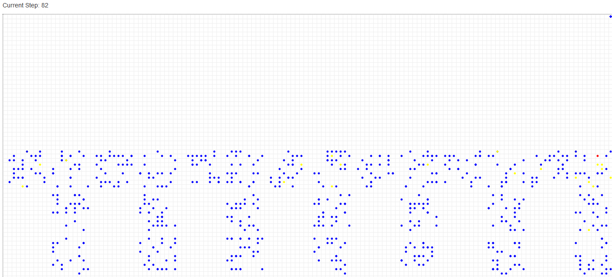
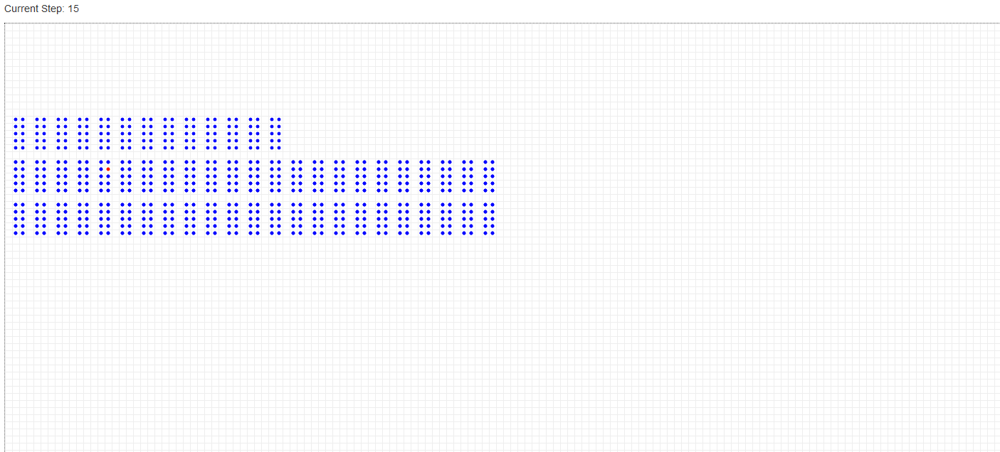
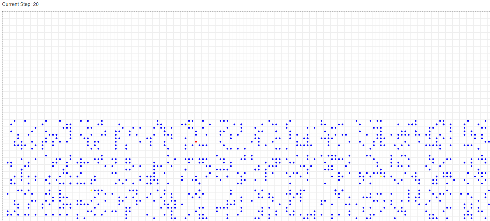

# MesaABM
#### 대조군

#### 가설 1번
교차개학 여부

#### 가설 2번

#### 가설 3번

#### 가설 4번

Modelling the spread of COVID-19 in Korean schools.
Created using [Mesa](https://mesa.readthedocs.io/)

## How to run
1. Install [Python](https://www.python.org/downloads/) if you haven't yet.
2. Download this repository, and unzip it.
3. (Optional) Create a virtual environment in the `MesaABM` folder(directory) using [`venv`](https://docs.python.org/3/library/venv.html), and activate the environment.
4. Run `pip3 install -r requirements.txt` in Command Prompt(Windows) or Terminal(MacOS/Linux).
5. Run `python3 run.py`.
