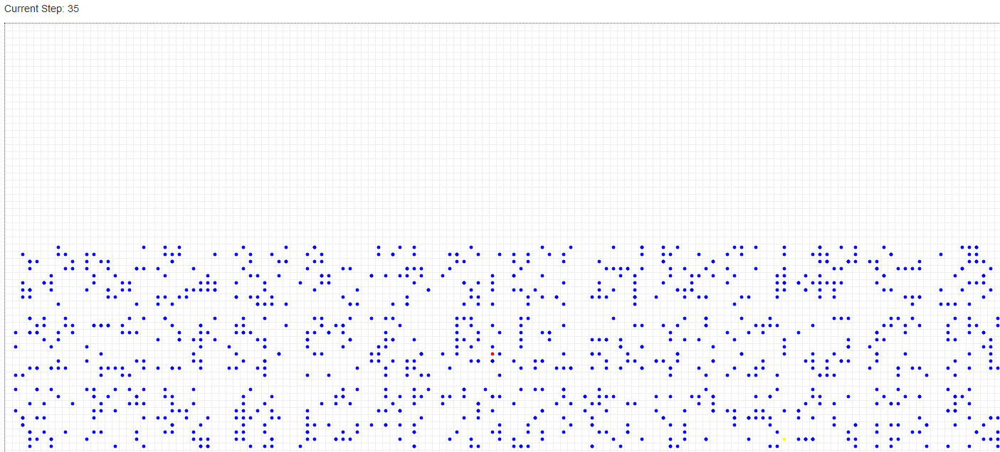

# MesaABM

## 모델 실행 시각화
#### 대조군

#### 가설 1번
교차개학 여부

#### 가설 2번
보충 및 야자 여부

#### 가설 3번
같은 학년의 학반 사이 이동 금지

#### 가설 4번
급식 순서를 반별로

## How to visualize / 모델 실행을 시각화하는 법
1. 최신 Release의 압축파일을 다운로드한다.
2. 압축 해제 후 `gui.exe`를 실행한다.
3. 인자를 설정한다.
4. "시각화" 버튼을 누른다.

## Extract Data / 데이터 추출하기
1. 최신 Release의 압축파일을 다운로드한다.
2. 압축 해제 후 `gui.exe`를 실행한다.
3. 인자, 데이터 저장 폴더, 반복 횟수를 설정한다.
4. "시작" 버튼을 누른다.

## Modify Model / 모델 변형하기
참고자료
- [Mesa Documentation](https://mesa.readthedocs.io/en/master/)
